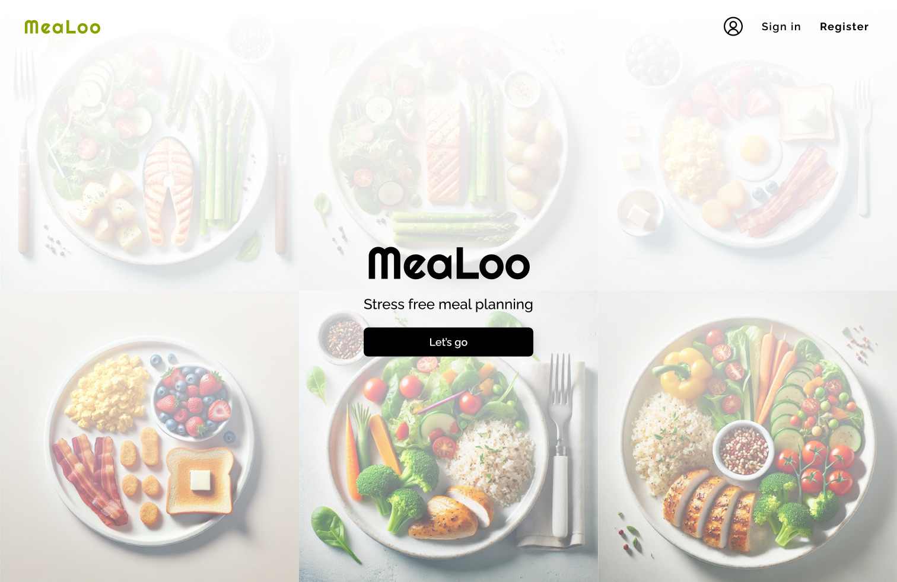

# Meet MeaLoo

This is a Next.js meal planning project part of the Xata Summer Hackathon featuring:

- **[Prisma](https://www.prisma.io/docs):** Prisma ORM is an open source Node.js and TypeScript ORM with a readable data model, automated migrations, type-safety, and auto-completion.
- **[Xata](https://xata.io/docs):** Xata is a serverless data platform, built on PostgreSQL which provides a full-text and vector search engine, record-level file attachments, table-level aggregations and an optional ask endpoint to engage with with OpenAI's ChatGPT API.
- **[Clerk](https://clerk.com/docs):** Clerk is a User Management Platform, offering a complete suite of embeddable UIs, flexible APIs, and admin dashboards to authenticate and manage your users.
- **[Inngest](https://www.inngest.com/docs):** Inngest is an event-driven durable execution engine that enables you to run reliable code on any platform, including serverless.

## App overview

Below you can have a look at the initial UI designs I made in Figma. Actual UI will also be adjusted depending on UX experience.




How the app works:

The app has 3 pages: 
- a dashboard where users can easily access the meal plan assigned to the current week, 
- a creation page where users can create weekly meal plans, and 
- a plans page where users can view and manage all their plans - they can be assigned to specific weeks or deleted. 

After logging in, the user is given the choice to navigate to create a plan or to view all his meal plans.
To create a plan user adds a description of what he would like to eat on a selected weekday, and sends it to AI which generates a day meal plan. 
The user can then save it into the weekly meal plan. 
To complete the weekly meal plan, the user repeats this process for every day of the week.

After completing a weekly meal plan, this can be assigned to a specific week. Only complete plans can be assigned.

When assigning a plan to a week, an Inngest function checks if it has a shopping list, and if not, it asks AI to generate one under the hood and then saves it for the user. 
The shopping list is then viewable on the dashboard for the plans assigned to the current week

## Using the webapp on your local (part of the template description)

**Clone the repo**

This boilerplate was created using [`create-next-app`](https://github.com/vercel/next.js/tree/canary/packages/create-next-app), has Prisma already set up (see [`./prisma`](./prisma)), as well as Inngest (see [`./inngest`](./inngest) and [`./api/inngest`](./api/inngest)).
While Inngest requires an account for production, using [Inngest Dev Server](https://www.inngest.com/docs/local-development) for local development is free and doesn't require any setup.
The following steps will guide you through setting up your Xata and Clerk accounts.

### 1. Xata database setup

#### Install Xata CLI

```bash
npm install -g @xata.io/cli
```

#### Authenticate with Xata

```bash
xata auth login
```

Next:

1. Choose Create new API key in the browser.
2. Create account or sign in in the browser.
3. Create a new API key.

#### Create a new Xata database with direct Postgres access

1. Go to the [Xata dashboard](https://app.xata.io/).
2. Create a new database, choosing the **Enable direct access to Postgres** option.
3. Once you've created the database, click the "Generate new API key" button in the database settings screen.

You will be now be able to see your Xata database connection string, with the pre-populated API key, which looks like this:

```
postgresql://<YOUR_WORKSPACE_ID>:<YOUR_API_KEY>@<YOUR_REGION>.sql.xata.sh:5432/<YOUR_DATABASE_NAME>:<YOUR_BRANCH_NAME>
```

<!-- REWORD -->

Back in your code editor, in your project's root create a new file called `.env`. Using the value from the previous step, add a new environment variable called `DATABASE_URL`, like this:

```conf
DATABASE_URL=postgresql://...?sslmode=require
```

#### Create another Xata database to be used for Prisma Migrations

Migrations with Prisma require a [shadow database](https://www.prisma.io/docs/orm/prisma-migrate/understanding-prisma-migrate/shadow-database). For this purpose, you'll need to create an additional database in Xata.

Repeat the previous step's instructions to create a new database. Name it something like `<YOUR_APP_NAME>-migrations`.

This time you'll need to populate the API key in the connection string by hand. You can use the same API key as for the main database connection.

Once done, configure the database connection string in your `.env` file as `SHADOW_DATABASE_URL`:

```conf
SHADOW_DATABASE_URL=postgresql://...?sslmode=require
```

#### Initialize database schema

Run the initial Prisma migration to create the database schema.

```bash
npx prisma db push
```

### 2. Clerk

#### Create a new application in Clerk

Sign up or sign in to [Clerk](https://dashboard.clerk.com/) and create a new application.

Choose any login mechanisms you'd like to allow your users to sign in with. You can change these later.

Once the application is created, see the section called "Set your environment variables" and copy the generated environment variables and add them to your `.env` file

```conf
NEXT_PUBLIC_CLERK_PUBLISHABLE_KEY=pk_test_abcdefghijklmnopqrstuvwxyz
CLERK_SECRET_KEY=••••••••••••••••••••••••••••••••••••••••••••••••••
```

You'll also need to add one more variable to let Clerk know where to redirect on successful login

```conf
NEXT_PUBLIC_CLERK_SIGN_IN_FORCE_REDIRECT_URL=/dashboard
```

You can skip the other suggested steps in the Clerk setup, they've already been included in this boilerplate.

## Running the app

You will use two Dev Servers.

### Next.js Dev Server

```bash
npm run dev
# or
yarn dev
# or
pnpm dev
# or
bun dev
```

Open [http://localhost:3000](http://localhost:3000) with your browser to see your app.

### Inngest Dev Server

```bash
npx inngest-cli dev
```

Open [http://localhost:8288](http://localhost:8288) with your browser to see the Inngest UI.
